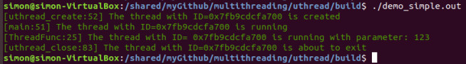
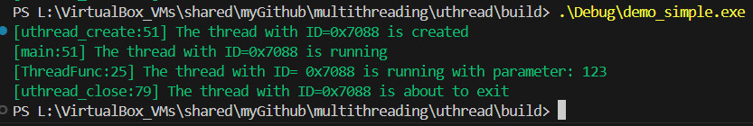

This repo is to provide an implementation of the cross-platform multithreading library on Linux and Windows and its application. Similar to pthread - the multithreading library in Linux, it is called uthread, which means universal multithreading.

# uthread

So far now, the uthread supports the following interface functions:
```
// Create a new thread
int32_t uthread_create(struct uthread_t** pphandle, const void* pattr,
                              const void* pfunc, const void* parg);

// Wait for the thread to finish
int32_t uthread_join(const struct uthread_t* phandle);

// Exit the current thread
int32_t uthread_close(const struct uthread_t* phandle);

// Get the thread ID
int32_t uthread_id_get(const struct uthread_t* phandle,
                       uint64_t*               thread_id);

// Sleep for specified time in microseconds
int32_t uthread_sleep(uint64_t microseconds);

// Initialize mutex
int32_t uthread_mutex_init(struct uthread_mutex_t** ppmutex);

// Deinitialize mutex
int32_t uthread_mutex_deinit(const struct uthread_mutex_t* pmutex);

// Lock mutex
int32_t uthread_mutex_lock(const struct uthread_mutex_t* pmutex);

// Unlock mutex
int32_t uthread_mutex_unlock(const struct uthread_mutex_t* pmutex);

// Initialize condition variable
int32_t uthread_cond_init(struct uthread_cond_t** ppcond);

// Deinitialize condition variable
int32_t uthread_cond_deinit(const struct uthread_cond_t* pcond);

// Wait for condition variable
int32_t uthread_cond_wait(const struct uthread_cond_t*  pcond,
                          const struct uthread_mutex_t* pmutex);

// Signal one waiting thread
int32_t uthread_cond_signal(const struct uthread_cond_t* pcond);

// get the version number
const uint8_t* uthread_version();

```

1. How to build
+	Linux：install gcc and cmake first, then in Shell terminal, follow the following steps:
```
	cd uthread
	mkdir build && cd build
	cmake ..
	make
```
+	Windows: install Visual Studio build tools and cmake first, then in Powershell, follow the following steps:
```
	cd uthread
	mkdir build && cd build
	cmake ..
	cmake --build .
```
2. How to run
+	Linux：run
```
	cd build
	./demo_simple.out
```
+	Windows: run
```
	cd build
	.\Debug\demo_simple.exe
```
3. test results
+	Linux：

+	Windows:

# producer-consumer problem

In order to validate the usability of the uthread library to solve the real problem, we use it to solve the common producer-consumer problem by taking the example of producing and consuming items in a warehouse.

This sub-repo uses the uthread by linking the latter as a dynamic library when creating the exectuable, see CMakeLists.txt for details.

The steps of building and running this demo are similar to uthread library, see above as a reference.

